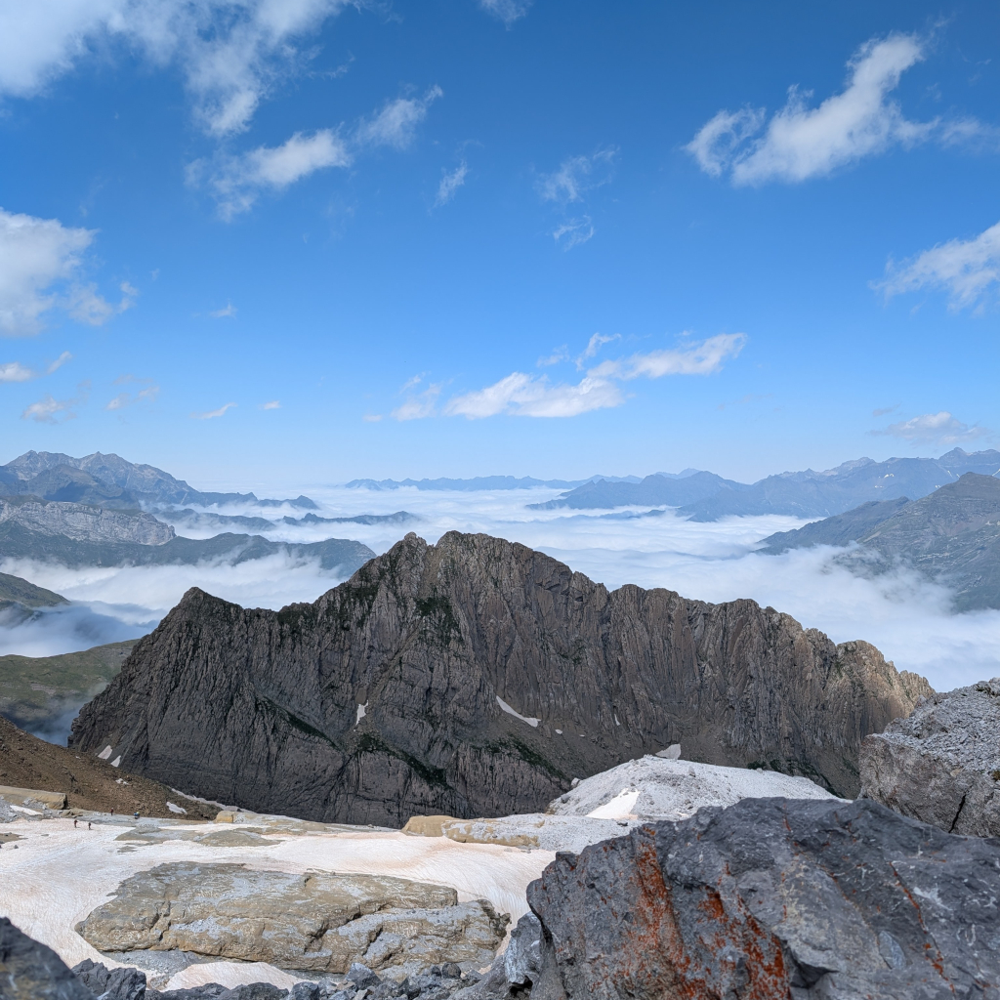

# Introduction
Implementation of the Bit Plane Complexity Segmentation algorithm to hide data in images by Eiji Kawaguchi and Richard O.
The algorithm replaces the complex regions of the image (that the eye cannot make a sense of anyway) with the hidden data. Enabling a **storage capacity of 60-40%** of the original image size, which is significantly higher than other steganography techniques such as LSB (Least Significant Bit).

| Image A | Image B |
|:---:|:---:|
|  |  |

*Will you be able to guess which image secretly hides 28k lines of Shakespeare?*

<details>
<summary>Answer</summary>

Image B: `demo/mountains_hidden.png` holds 831 KB of Shakespeare plays. Image A is the original `demo/mountains.jpg`.
</details>

## Coding style
The code is fully object oriented, here is a description of the main classes :

- **HostImage(BW/Color)** : A vessel image, in black and white or in color.
- **BitPlane64(ConjugateBit)** : An 8*8 block of pixel.
- **SecretData** : The data to hide.
- **Encoder** : His goal is to hide the data into the vessel.
- **Decoder** : His goal is to retrieve the data from the vessel.

## Running

### Requirements
- Python 3.9 or newer (tested with Python 3.14)
- Pillow and matplotlib:

```bash
python3 -m venv venv
source venv/bin/activate
pip install pillow matplotlib
```

### Run the demo
Everything the demo needs is in the `demo/` folder:

| File | What it is |
|---|---|
| `demo/mountains.jpg` | The host image (1024x1024). |
| `demo/shakespeare.txt` | The secret: ~830 KB (28k lines) of Shakespeare plays, as much as the host image can hold. |
| `demo/mountains_hidden.png` | The host image with `shakespeare.txt` hidden inside. It is 1.7 MB because PNG is lossless and the hidden bits don't compress. |

`bpcs.py` is the demo entry point. Run it from the project root:

```bash
python3 bpcs.py | grep -v "^in :\|^out :\|^b'\|^bytearray"   # filters out the full binary data dumps
cmp demo/shakespeare.txt decoded/shakespeare.txt && echo "identical"
```

It hides `demo/shakespeare.txt` inside `demo/mountains.jpg`, writes the result to `demo/mountains_hidden.png`, then decodes that image and writes the recovered file to `decoded/shakespeare.txt`. The `decoded/` folder is created automatically and is git-ignored. At the end it prints the demo stats: available blocks, blocks used, and encoding and decoding times. For the demo image at threshold 0.45, that's 105,555 blocks available and 105,549 used, about 9s to encode and 5s to decode.

To use your own files, change the values in `bpcs.py`:

```python
secret = SecretData(data_loader.load_file_as_binary('path/to/secret.file'), complexityThreshold=0.3)
host = HostImageColor(host_path='path/to/host.png', complexity_threshold=0.3)
encoder = Encoder(host_image=host, complexity_threshold=0.3, secret_data=secret, file_name="secret.file")
encoder.encode().write_image_to('path/to/output.png')

decoder = Decoder(source_file_path='path/to/output.png', complexity_threshold=0.3, black_white=False)
decoder.decode()   # writes decoded/<file_name>
```

### Constraints
- The host image must be a **square** whose side length is a multiple of 8 (e.g. 128x128, 512x512).
- The host can be any format Pillow reads, including JPEG. Save the output as **PNG** (lossless). A lossy format like JPEG destroys the hidden data.
- The complexity threshold must be below 0.5, and **the same threshold must be used for encoding and decoding**.
- `file_name` is stored inside the image and is limited to about 39 bytes.
- Capacity depends on the host image. Data is only written to the 4 least significant bit layers of each color channel. If the secret doesn't fit, the encoder raises `Not enough storage in the host image`. At threshold 0.45, `demo/mountains.jpg` holds 831,245 bytes at most.
- Encoding is pure Python, so large images or large secrets can take a while.
